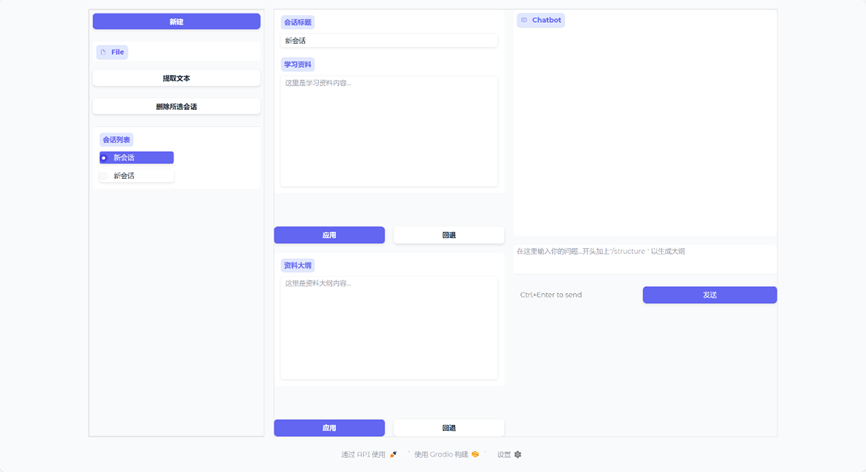

# 用户手册

## 1. 简介
AI Outline Generator 是一款基于AI的文档大纲自动生成工具，支持多种文档格式，适用于学生、教师、内容创作者等。

## 2. 安装指南
- 系统要求：Windows 10/11，Python 3.8及以上
- 安装步骤：
  1. 下载源码
  2. 安装依赖：`pip install -r requirements.txt`
  3. 运行：`python web/app.py`

## 3. 快速开始
- 启动后，打开浏览器访问 http://localhost:7861
- 点击“新建”创建会话
- 点击“上传材料”，选择你的文档
- 点击“提取文本”，自动生成大纲

## 4. 功能介绍
- 支持txt、docx、pptx、pdf等格式
- 支持多会话管理
- 支持大纲结构自定义

接下来说明按键交互
### 一 左边栏-历史记录
1.	“新建”按钮：创建新对话
    注意：如果没有任何历史对话时（比如首次启动应用）开启，会报错
2.	“File”按钮： 上传文件，既可以拖动文件到空白框，也可以点击蓝色图标上传
    目前支持pdf,pptx,doc,md,以及文本文档
3.	提取文本：仅保留文件中的文字，只是
4.	删除所选会话：同上，请不要在无对话时点击
5.	会话列表：展示本地的对话记录，点击切换对话
### 二 中间栏-材料
1.	会话标题：可修改，与左侧同步
2.  学习资料：展示材料内容（纯文本） 可手动编辑，点击“应用”保存更改，“回退”到上一次保存的内容
3.  资料大纲：展示AI生成大纲，同样可进行手动修改
### 三 右侧栏-对话
1. 每次询问如果得到回复则会保存保存到本地，失败的询问不会保存
2. 点击“发送”或Ctrl+Enter发送询问
3. 模型每次都会读入资料和大纲，所以耗时较长，请耐心等待，不要刷新
4. 以/struture开头的询问会被视为修改大纲，同时读入现有资料，现有大纲以及当前询问，但不会阅读先前对话

## 6. 联系方式
- 开发者邮箱richard_yang_hao@163.com & atwr1292@163.com，期待您的使用与反馈

